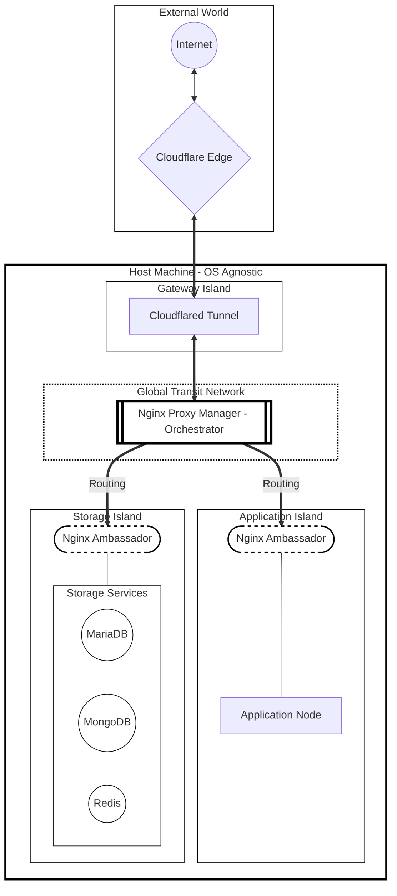

# ⚓ CORE-Islands: Sovereign Cloud Deployment

*On-Premise Framework with Micro-Segmentation and Zero-Trust Perimeter*

CORE-Islands implements **highly secure private clouds** on dedicated hardware with:

- 🌐 **Persistent Network**  
- 🔒 **Strict Service Isolation**  
- ⚓🌉 **"Anchors and Bridges" Architecture**

---

## 🚀 Deployment Sequence

The deployment must follow a **strict hierarchical order**, as each layer depends on the availability of the previous layer.

### 1️⃣ Core Layer: Global
Contains the **Orchestrator (NPM)** and defines the **global transit network**.

```bash
cd Global/
cp .env.example .env   # Configure global network names
docker-compose up -d
```

> ⚠️ Without this, no other island can communicate.

---

### 2️⃣ Bridge Layer: Gateway
Houses the **Cloudflare Tunnel**, connected to the previously created transit network.

```bash
cd ../Gateway/
cp .env.example .env   # Insert your CLOUDFLARE_TUNNEL_TOKEN
docker-compose up -d
```

---

### 3️⃣ Persistence Layer: Database
Deploys the **Storage Island**. Requires both the Gateway and Global layers to be active.

```bash
cd ../Database/
cp .env.example .env   # Define DB credentials and Ambassador rules
docker-compose up -d
```

---

## 🛠️ Verification Checklist

- **Networks:**  
  ```bash
  docker network ls
  ```  
  The defined networks should appear (`global_network`, `database_network`)

- **Connectivity:**  
  `Cloudflared` container should report status **Connected**  

- **Isolation:**  
  `ping google.com` from MariaDB should fail (internal network)

---

## 📁 Repository Structure

```plaintext
.
├── Global/            # Step 1: Orchestration & Global Network
├── Gateway/           # Step 2: Zero Trust Tunneling
├── Database/          # Step 3: Isolated Storage & DB Ambassadors
├── Applications/      # (Optional) Specific Application Islands
└── README.md          # Project Documentation
```

---

## 📐 CORE-Islands Network Diagram



---

## 🏷️ Credits & Authorship

- **Lead Architect & Maintainer:** @gabypuertor964 ([Github](https://github.com/gabypuertor964) / [LinkedIn](https://www.linkedin.com/in/gabypuertor964/)) 
- **Technical Copilot:** Powered by **Google Gemini** (AI Orchestration)  
- **License:** Apache License 2.0