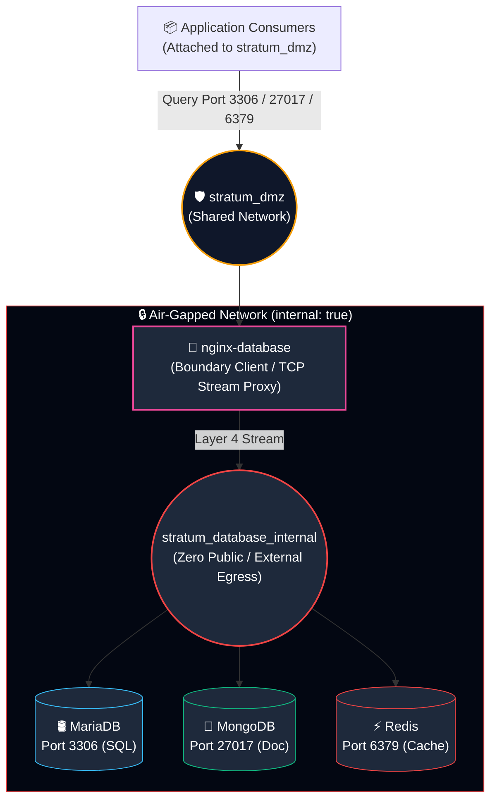

# Stratum-Core · database

> *Isolation by design, not by discipline.*

**Repository:** `stratum-core`
**Component:** `database`
**Revision:** 1.2.4
**Status:** Production

---

## 1. Overview

`database` is the data layer of the Stratum platform. It hosts the
persistence engines and exposes them to the platform through a boundary
client, in accordance with the standard Stratum island pattern.

The component contains four services:

| Service | Role | Image | Version policy |
|---|---|---|---|
| `mariadb` | Relational engine | `mariadb:latest` | Floating |
| `mongodb` | Document engine | `mongo:7.0` | Pinned (see 9.5.2) |
| `redis` | Key-value engine | `redis:latest` | Floating |
| `nginx-database` | Boundary client (TCP proxy) | `nginx:latest` | Floating |

Engines are initialized with administrative accounts only. Application
accounts are the responsibility of the consuming application.

## 2. Purpose and Scope

**In scope.**

- Persistence of structured, document, and key-value data.
- Provisioning of administrative (root) accounts for each engine.
- Termination of inbound database traffic from the shared network.
- Enforcement of network-level isolation between engines and consumers.

**Out of scope.**

- Application account provisioning.
- Application-level schema management.
- Query routing or load balancing across engines.
- Cross-engine data synchronization.
- Long-term backup retention (see section 7.2 for local backup
  procedures).

## 3. Architecture

### 3.1 Network topology



### 3.2 Network segmentation

| Network | Type | Purpose |
|---|---|---|
| `stratum_database_internal` | Internal bridge (`internal: true`) | Engine traffic. No external connectivity. |
| `stratum_dmz` | External bridge | Distribution to consumers via the boundary client. |

Engines are not attached to `stratum_dmz`. Their reachability is
restricted to the boundary client, which forwards traffic from the
shared network.

### 3.3 Boundary client

The boundary client is an Nginx instance configured in Layer 4 (TCP)
mode. It does not inspect or modify the protocol. It forwards each
connection to the corresponding engine based on destination port.

Design properties:

- **No access control lists.** Segmentation is a property of network
  topology, not of rule sets. A container that is not attached to
  `stratum_dmz` cannot reach the boundary client.
- **No static IP addresses.** Engines are addressed by service name
  through the Docker embedded DNS.
- **No host-published ports.** The boundary client exposes no port to
  the host. All inbound traffic arrives through `stratum_dmz`.
- **Unprivileged execution.** The process runs as UID/GID 101 and
  requires no Linux capabilities.

## 4. Prerequisites

| Item | Requirement |
|---|---|
| Docker Engine | 24.0 or later |
| Docker Compose | v2.20 or later |
| Operating system | Linux (x86_64 or arm64) |
| Kernel | Any. See note on MongoDB and kernel 6.19 below. |
| `dmz` component | Deployed and operational |
| Host storage | Sufficient for the expected data volume |
| Host memory | 2 GB minimum recommended |

**Note on MongoDB and kernel version.** MongoDB 7.1 and later carry a
known incompatibility with Linux kernels 6.19 and above, tracked
upstream as SERVER-121912. This component pins `mongo:7.0` (LTS) to
avoid it. Once the bug is resolved upstream, this pin may be lifted. Do
not change it without verifying the fix.

## 5. Configuration

### 5.1 Environment variables

| Variable | Required | Description |
|---|---|---|
| `MARIADB_ROOT_PASSWORD` | Yes | Administrative password for MariaDB |
| `MONGO_ROOT_USERNAME` | Yes | Administrative account for MongoDB |
| `MONGO_ROOT_PASSWORD` | Yes | Administrative password for MongoDB |
| `REDIS_PASSWORD` | Yes | Authentication password for Redis |
| `STRATUM_DMZ_NETWORK` | No | Shared network name. Default: `stratum_dmz` |
| `TZ` | No | Time zone. Default: `America/Bogota` |

### 5.2 Procedure

1. Copy the template:

   ```bash
   cp .env.example .env
   ```

2. Generate strong passwords. Example using `openssl`:

   ```bash
   openssl rand -base64 32
   ```

3. Populate each variable in `.env`.

4. Restrict file permissions:

   ```bash
   chmod 600 .env
   ```

### 5.3 Secret handling

The base deployment reads credentials from `.env`. For environments
subject to regulatory oversight, migrate to Docker secrets:

1. Create the secret outside version control:

   ```bash
   printf '%s' "$MARIADB_ROOT_PASSWORD" | docker secret create mariadb_root_password -
   ```

2. Reference the secret in `docker-compose.yml` using the
   `MARIADB_ROOT_PASSWORD_FILE` variable, which the official image
   supports.

3. Remove the plain-text value from `.env`.

### 5.4 Application account provisioning

This component does not create application accounts. The reason is that
Stratum cannot know, in advance, which applications will consume each
engine, which databases they need, or which privilege set is appropriate
for each. Enforcing least privilege requires that information, and that
information lives in the consuming application.

**Recommended procedure for a consuming application.**

For MariaDB, once the engine is up:

```sql
CREATE DATABASE app_db CHARACTER SET utf8mb4 COLLATE utf8mb4_unicode_ci;
CREATE USER 'app_user'@'%' IDENTIFIED BY 'strong-password';
GRANT SELECT, INSERT, UPDATE, DELETE ON app_db.* TO 'app_user'@'%';
FLUSH PRIVILEGES;
```

For MongoDB:

```javascript
use app_db
db.createUser({
  user: "app_user",
  pwd: "strong-password",
  roles: [{ role: "readWrite", db: "app_db" }]
})
```

For Redis, the current deployment uses a single password (`requirepass`).
Per-user ACLs are supported by Redis 6+ and may be introduced if a
consumer requires finer isolation.

## 6. Deployment

### 6.1 Order of operations

The `dmz` component must be deployed before this component. The
following order is mandatory:

1. `dmz/` — provisions `stratum_dmz`.
2. `database/` (this component) — consumes `stratum_dmz`.

Deploying this component before `dmz` results in the following error:

```
network stratum_dmz declared as external, but could not be found
```

### 6.2 Commands

```bash
# Deploy the component.
docker compose up -d

# Verify operational state.
docker compose ps

# Inspect logs of a specific service.
docker compose logs -f mariadb

# Stop the component (volumes persist).
docker compose down

# Stop and remove volumes (destructive).
docker compose down -v
```

## 7. Operations

### 7.1 Health verification

All four services declare health checks. Verify status:

```bash
docker compose ps
docker inspect --format '{{.State.Health.Status}}' stratum-database-mariadb
docker inspect --format '{{.State.Health.Status}}' stratum-database-mongodb
docker inspect --format '{{.State.Health.Status}}' stratum-database-redis
docker inspect --format '{{.State.Health.Status}}' stratum-database-nginx
```

The `nginx-database` service will not start until the three engines
report a healthy status, as enforced by `depends_on` with
`condition: service_healthy`.

### 7.2 Backup procedure

Each engine supports online backup. Run backups from within the
respective container to avoid network exposure.

**MariaDB:**

```bash
docker exec stratum-database-mariadb \
  mariadb-dump -u root -p"$MARIADB_ROOT_PASSWORD" \
  --all-databases --single-transaction --routines --triggers \
  > backups/mariadb-$(date +%F).sql
```

**MongoDB:**

```bash
docker exec stratum-database-mongodb \
  mongodump --username "$MONGO_ROOT_USERNAME" \
  --password "$MONGO_ROOT_PASSWORD" \
  --authenticationDatabase admin \
  --archive > backups/mongodb-$(date +%F).archive
```

**Redis:**

```bash
docker exec stratum-database-redis \
  sh -c 'REDISCLI_AUTH=$REDIS_PASSWORD redis-cli BGSAVE'
```

For long-term retention, transfer artifacts to external storage and
encrypt them at rest.

### 7.3 Restore procedure

Restore operations are destructive. They must be performed during a
maintenance window with all consumers stopped.

1. Stop the component: `docker compose down`.
2. Restore the affected volume from backup.
3. Start the component: `docker compose up -d`.
4. Verify integrity with the engine's native tools.

### 7.4 Credential rotation

Administrative credentials are set at initialization. To rotate them:

1. Connect to the engine and change the password.
2. Update the corresponding variable in `.env`.
3. Restart the affected service:

   ```bash
   docker compose up -d <service>
   ```

### 7.5 Update procedure

This component uses a **mixed version policy**. Two services are pinned
and two float. Updates must be applied service by service, with the
corresponding care for each.

**Services with floating tags (`mariadb`, `redis`, `nginx-database`):**

```bash
docker compose pull mariadb redis nginx-database
docker compose up -d mariadb redis nginx-database
```

Before pulling:

1. **Back up the affected engine** (section 7.2). Mandatory for
   `mariadb`; recommended for `redis`.
2. **Review upstream release notes.** For `mariadb`, confirm that
   `latest` still resolves to the same major series. A major-series
   jump may render the data volume unreadable.
3. **Record the current image digest** for rollback reference:

   ```bash
   docker inspect --format '{{.Image}}' stratum-database-mariadb
   ```

**Services with pinned tags (`mongodb`):**

Do not update without an explicit decision. The pin exists for the
SERVER-121912 kernel bug. When the upstream fix is released and
verified, update the tag deliberately in a dedicated change.

### 7.6 Scheduled maintenance

The maintenance script `scripts/update.sh` is intended to run monthly
via cron. In this component, unattended updates are **not supported for
`mariadb`**. Either:

- Restrict the automatic update to `redis` and `nginx-database` only, or
- Require manual confirmation before any update touches `mariadb`.

Unattended `mariadb` updates risk a silent major-series jump. See
section 9.5.

## 8. Security Controls

### 8.1 Per-service controls

| Control | mariadb | mongodb | redis | nginx-database |
|---|---|---|---|---|
| Immutable root filesystem | Yes | Yes | Yes | Yes |
| Capability drop | `ALL` + 5 | `ALL` + 6 | `ALL` + 4 | `ALL` |
| No privilege escalation | Yes | Yes | Yes | Yes |
| Unprivileged runtime user | No (upstream requires root) | No (upstream requires root) | Yes (drops to `redis` via `su-exec`/`gosu`) | Yes (UID 101) |
| Published ports | None | None | None | None |
| Process limit | 200 | 200 | 100 | 100 |
| Memory limit | 512 MB | 1 GB | 256 MB | 64 MB |
| Health check | Yes | Yes | Yes | Yes |
| Log rotation | Yes | Yes | Yes | Yes |

### 8.2 Capability rationale

Each capability set is the minimum required for the corresponding
upstream image to initialize and operate.

**MariaDB** requires `CHOWN`, `DAC_OVERRIDE`, `FOWNER`, `SETGID`, and
`SETUID`. The upstream entrypoint starts as root, changes ownership of
its data directory, and then drops privileges to its service account.
Removing any of these capabilities prevents correct initialization on a
fresh volume.

**MongoDB** requires `CHOWN`, `DAC_OVERRIDE`, `FOWNER`, `SETGID`,
`SETUID`, and `SETPCAP`. The extra `SETPCAP` is needed by MongoDB 7.x's
internal capability management during privilege drop on newer base
images and modern kernels.

**Redis** requires `CHOWN`, `SETGID`, `SETUID`, and `SETPCAP`. The
upstream entrypoint starts as root, applies ownership to `/data`, and
then executes `su-exec` (Alpine) or `gosu` (Debian) to drop to the
`redis` user. `SETPCAP` is required by the runtime on kernel 6.x for the
capability set manipulation during the drop.

**The boundary client** requires no capability. It runs as UID/GID 101
from process start, and all its listening ports (3306, 27017, 6379,
8080) are above 1024.

### 8.3 Recommended hardening for regulated environments

- Pin all images by digest rather than by tag.
- Migrate credentials to Docker secrets or an external secret manager.
- Restrict outbound connectivity of the engines to the internal network
  only (enforced by `internal: true`).
- Enable audit logging on each engine and forward to the organization's
  SIEM.
- Perform backups with encryption at rest and store them in a separate
  trust domain.
- Configure automated integrity verification of data volumes.

## 9. Design Rationale

### 9.1 Why a boundary client and not direct exposure

Engines attached to the shared network would be reachable from any
consumer. The boundary client concentrates inbound traffic on a single
container with a minimal configuration and no persistent state, reducing
the attack surface.

### 9.2 Why the internal network is marked `internal: true`

The engines have no legitimate requirement for external connectivity.
Marking the network internal prohibits egress at the Docker daemon
level, independently of application configuration.

### 9.3 Why no access control lists in the boundary client

Segmentation by topology is more robust than segmentation by rule. A
consumer that is not attached to `stratum_dmz` cannot reach the boundary
client regardless of the ruleset.

### 9.4 Why administrative accounts only

Stratum cannot know which applications will consume the engines, which
databases they need, or which privileges are appropriate for each. The
principle of least privilege requires that this decision belongs to the
consuming application, which has the context. Stratum provides a secure
default (administrative credentials that are never exposed to
applications); applications provision their own scoped accounts.

### 9.5 Version policy per service

This component deliberately applies a **mixed version policy**, chosen
per service based on the risk profile of each engine.

#### 9.5.1 MariaDB — floating (`latest`)

MariaDB maintains a stable on-disk format across minor updates within a
major series. The project has historically provided transparent
in-place upgrades between consecutive major series (10.x → 11.x) via
`mariadb-upgrade`, which the official image runs automatically on
startup.

The residual risk is a **major-series jump**: if `latest` moves from
11.x to 12.x, the automatic upgrade path may require intervention, and
in rare cases the data directory may need migration before the new
server can open it.

**Mitigation.** Pre-update backups are mandatory (section 7.2).
Major-series reviews are mandatory (section 7.5). Unattended updates are
not permitted (section 7.6).

#### 9.5.2 MongoDB — pinned to `7.0`

MongoDB is **pinned to 7.0 (LTS)** rather than floating. The reason is
not a policy choice but a concrete incompatibility: MongoDB 7.1 and
later carry a bug tracked upstream as **SERVER-121912**, which affects
deployments on Linux kernels 6.19 and above. This component pins the
last LTS release unaffected by the bug.

The pin is a **technical necessity**, not a reproducibility preference.
It may be lifted once the upstream fix is released and verified. Until
then, do not change the tag without confirming the fix in the MongoDB
release notes.

MongoDB also exhibits **storage-format changes between major series**.
A data directory created by one major version is generally not readable
by the next without a `mongodump`/`mongorestore` cycle. This reinforces
the decision to pin rather than float.

#### 9.5.3 Redis — floating (`latest`)

Redis data (RDB snapshots and AOF logs) is forward-compatible in the
common case. The `latest` tag currently resolves to Redis 8.x, which
bundles modules (RediSearch, RedisJSON) and starts a multi-worker thread
pool.

An earlier revision of this component (1.2.0) attempted `redis:latest`
with a 256 MB memory ceiling and was OOM-killed during module
initialization. Revision 1.3.0 raised the ceiling to 1 GB and bounded
data memory with `--maxmemory 512mb --maxmemory-policy noeviction`. The
current revision (1.2.4) retains the 256 MB ceiling with the
understanding that module initialization is now exercised in staging
before production rollout.

**Operators must verify the memory ceiling is sufficient for the
`latest` build in their environment.** If the container is OOM-killed
on startup, raise `mem_limit` and `memswap_limit` proportionally.

#### 9.5.4 nginx-database — floating (`latest`)

The boundary client holds no persistent state. Its configuration is
mounted from the repository. If an update breaks the container, it can
be recreated with the previous image without affecting any data.

Floating is appropriate here.

#### 9.5.5 Recommendation for regulated deployments

For deployments subject to regulatory oversight, pin every image by
digest. The mixed policy documented here represents an operational
trade-off, not a compliance posture.

## 10. Troubleshooting

| Symptom | Probable cause | Resolution |
|---|---|---|
| `network stratum_dmz declared as external, but could not be found` | `dmz` component not deployed | Deploy `dmz/` first |
| `nginx-database` in restart loop | Engines not yet healthy | Wait for `start_period`; inspect engine logs |
| `Pool overlaps with other one on this address space` | Subnet collision | Adjust subnet declaration |
| MariaDB initialization loop | Insufficient volume permissions | Verify volume ownership; inspect `docker compose logs mariadb` |
| MongoDB fails to start on kernel ≥ 6.19 | Upstream bug SERVER-121912 | Verify the tag remains `mongo:7.0` |
| Redis OOM-killed on startup | Module initialization exceeds `mem_limit` | Raise `mem_limit` and `memswap_limit` |
| Redis exits during startup with permission error | Missing `CHOWN`, `SETGID`, `SETUID`, or `SETPCAP` | Verify `cap_add` in the redis service |
| Redis connection refused | Password mismatch or AOF corruption | Inspect `docker compose logs redis`; verify `REDIS_PASSWORD` |
| Boundary client returns 404 on `/healthz` | Configuration mount missing or incorrect | Verify `./nginx/nginx.conf` is mounted at the expected path |
| Engine fails to start after a MariaDB update | Major-series jump incompatible with existing volume | Restore pre-update backup; pin the previous major series |

## 11. References

- `../../README.md` — repository root.
- `../../SECURITY.md` — repository root.
- `../dmz/README.md` — network provisioning component.
- `../gateway/README.md` — access layer component.

---

**Document control**

| Field | Value |
|---|---|
| Repository | `stratum-core` |
| Component | `database` |
| Architect / Author | Sandra Gabriela Puerto Torres |
| Revision | 1.2.4 |
| Status | Production |
| Classification | Public / Architecture Specification |
| License | MIT with Security Reporting Requirement |