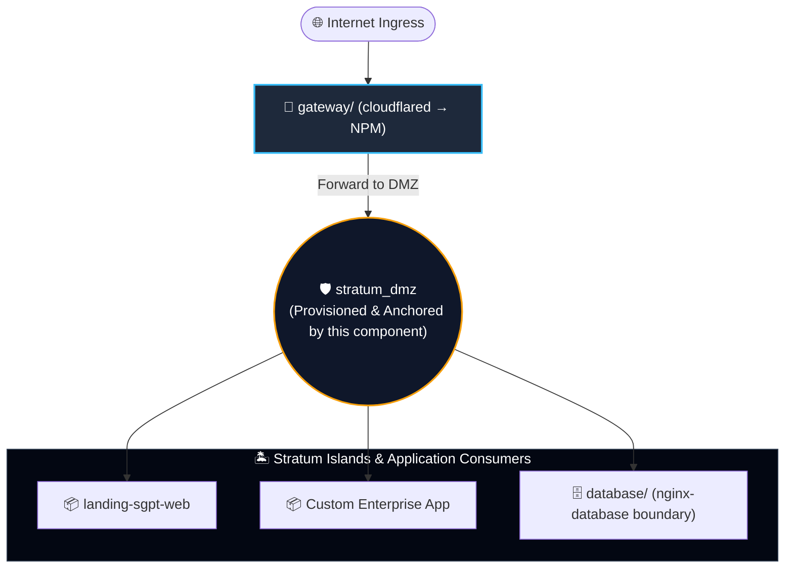

# Stratum-Core · dmz

> *Isolation by design, not by discipline.*

**Repository:** `stratum-core`
**Component:** `dmz`
**Revision:** 1.0.0
**Status:** Production

---

## 1. Overview

`dmz` is a foundational component of the Stratum platform. It provisions
and maintains `stratum_dmz`, the shared Docker network that serves as the
point of convergence between the access layer (`gateway`) and the
boundary clients of each Stratum island (`database` and any future
island).

The component does not host business services. It contains no
application logic, exposes no network ports, and processes no data. Its
sole responsibility is the lifecycle of the shared network.

## 2. Purpose and Scope

**In scope.**

- Provisioning of the `stratum_dmz` network.
- Maintenance of the network for the lifetime of the platform.
- Documentation of the network's configuration parameters.

**Out of scope.**

- Hosting of any business service.
- Termination of ingress or egress traffic.
- Reverse proxying, load balancing, or routing.
- Management of secrets or credentials.
- Management of certificates or TLS material.

Any addition of services to this component constitutes a deviation from
the Stratum design and is not supported.

## 3. Architecture

### 3.1 Network topology



`stratum_dmz` is the only network shared across Stratum islands. All
other networks are internal to their respective islands and are not
reachable from this component.

### 3.2 Anchor mechanism

Docker Compose does not permit the declaration of a network without at
least one attached service. To satisfy this constraint, the component
deploys a minimal anchor container (`stratum-dmz-anchor`) whose sole
function is to keep the network alive. The anchor executes no
application logic.

## 4. Prerequisites

| Item | Requirement |
|---|---|
| Docker Engine | 24.0 or later |
| Docker Compose | v2.20 or later |
| Operating system | Linux (x86_64 or arm64) |
| Privileges | Ability to create Docker networks |
| Host ports | None required |

## 5. Configuration

### 5.1 Environment variables

| Variable | Required | Default | Description |
|---|---|---|---|
| `STRATUM_DMZ_NETWORK` | No | `stratum_dmz` | Name of the shared network |
| `STRATUM_DMZ_SUBNET` | No | `172.16.0.0/24` | IPv4 CIDR range of the shared network |

### 5.2 Procedure

1. Copy the template:

   ```bash
   cp .env.example .env
   ```

2. Edit `.env` and set values appropriate for the target environment.

3. Restrict file permissions:

   ```bash
   chmod 600 .env
   ```

## 6. Deployment

### 6.1 Order of operations

The component must be deployed before any of its consumers. The
following order is mandatory:

1. `dmz/` — provisions `stratum_dmz`.
2. `gateway/` — consumes `stratum_dmz`.
3. `database/` — consumes `stratum_dmz`.

Deploying a consumer before this component results in the following
error at container startup:

```
network stratum_dmz declared as external, but could not be found
```

### 6.2 Commands

```bash
# Provision the network.
docker compose up -d

# Verify operational state.
docker compose ps

# Inspect logs.
docker compose logs -f

# Decommission (the network persists if consumers remain attached).
docker compose down
```

## 7. Operations

### 7.1 Health verification

The component contains no application service; traditional health
checks are not applicable. Operational verification consists of
confirming the network exists and the anchor is running:

```bash
docker network inspect stratum_dmz
docker inspect --format '{{.State.Status}}' stratum-dmz-anchor
```

### 7.2 Maintenance windows

The component may be restarted at any time without affecting running
consumers. The network persists as long as at least one consumer is
attached.

### 7.3 Update procedure

1. Edit `docker-compose.yml` and update the pinned image version.
2. Apply the change:

   ```bash
   docker compose up -d
   ```

3. Verify the container is running with the expected image.

## 8. Security Controls

The following controls are enforced on the anchor container:

| Control | Configuration | Rationale |
|---|---|---|
| Unprivileged user | `user: "65534:65534"` | Eliminates root within the container |
| Immutable filesystem | `read_only: true` | Prevents persistence of malicious code |
| Capability drop | `cap_drop: ALL` | Removes all Linux capabilities |
| No privilege escalation | `no-new-privileges:true` | Blocks setuid/setgid escalation |
| No published ports | (no `ports:` directive) | No host-level exposure |
| Process limit | `pids_limit: 10` | Prevents fork bombs |
| Memory limit | `mem_limit: 16m` | Prevents resource exhaustion |
| Swap limit | `memswap_limit: 16m` | Prevents swap-based escapes |
| Init process | `init: true` | Proper signal handling and reaping |
| Signal handling | `stop_signal: SIGTERM` | Clean termination |
| Grace period | `stop_grace_period: 5s` | Bounded shutdown window |
| Log rotation | 10 MB × 3 files, compressed | Bounded disk usage |

### 8.1 Recommended hardening for regulated environments

For deployments subject to regulatory oversight, the following
additional controls are recommended:

- Pin the base image by digest rather than by version tag.
- Deploy on a host with a read-only Docker daemon configuration.
- Enable Docker Content Trust or equivalent image signature verification.
- Monitor the container with the host's audit subsystem.

## 9. Design Rationale

**Why a dedicated component for network provisioning.**
Docker Compose does not support declaring a network without an attached
service. Isolating this constraint in a dedicated component prevents
its workaround from contaminating business components. The `dmz`
component is the only place in Stratum where the anchor pattern is
applied.

**Why the anchor executes no logic.**
Any logic executed by the anchor constitutes additional attack surface
without operational benefit. The container's only requirement is to
remain running.

**Why an unprivileged user.**
The anchor requires no elevated privileges. Running as UID/GID 65534
eliminates a class of container escape techniques that depend on
root-level capabilities.

**Why the network is not marked `internal: true`.**
The `internal: true` attribute prevents connectivity to networks outside
the Docker daemon's bridge scope. The DMZ must remain reachable by the
`gateway` component, which requires connectivity to the host's network
stack. Consumers that must not have external connectivity (such as the
data layer) enforce that constraint in their own network declarations.

## 10. Troubleshooting

| Symptom | Probable cause | Resolution |
|---|---|---|
| `network stratum_dmz declared as external, but could not be found` | Consumer deployed before this component | Deploy `dmz/` first |
| `Pool overlaps with other one on this address space` | Subnet collision with existing Docker network | Adjust `STRATUM_DMZ_SUBNET` in `.env` |
| Anchor in restart loop | Base image pull failure or incompatible runtime | Inspect `docker compose logs anchor` |
| Network disappears after `down` | No consumers attached | Expected behavior; redeploy to recreate |

## 11. References

- `../../README.md` — repository root.
- `../../SECURITY.md` — repository root.
- `../gateway/README.md` — access layer documentation.
- `../database/README.md` — data layer documentation.

---

**Document control**

| Field | Value |
|---|---|
| Repository | `stratum-core` |
| Component | `dmz` |
| Architect / Author | Sandra Gabriela Puerto Torres |
| Revision | 1.0.0 |
| Status | Production |
| Classification | Public / Architecture Specification |
| License | MIT with Security Reporting Requirement |