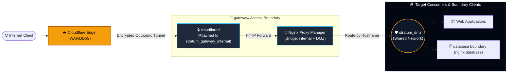

# Stratum-Core · gateway

> *Isolation by design, not by discipline.*

**Repository:** `stratum-core`
**Component:** `gateway`
**Revision:** 1.1.2
**Status:** Production

---

## 1. Overview

`gateway` is the access layer of the Stratum platform. It is the sole
point of contact between the Internet and the platform. All inbound
traffic is received through a Cloudflare Tunnel and distributed to the
boundary clients of each Stratum island through the shared network
`stratum_dmz`.

The component hosts two services: `cloudflared`, which maintains the
outbound tunnel to the Cloudflare edge, and `npm` (Nginx Proxy Manager),
which terminates inbound HTTP/HTTPS traffic and provides the
administrative interface for route and certificate management.

## 2. Purpose and Scope

**In scope.**

- Termination of inbound traffic from the Internet.
- Distribution of traffic to the Stratum DMZ.
- Management of TLS certificates.
- Provision of an administrative interface for routing configuration.
- Maintenance of a persistent outbound tunnel to Cloudflare.

**Out of scope.**

- Termination or routing of business logic.
- Access to the data layer.
- Provisioning of shared networks (responsibility of `dmz`).
- Management of credentials for other components.

## 3. Architecture

### 3.1 Network topology



### 3.2 Network segmentation

| Network | Type | Purpose |
|---|---|---|
| `stratum_gateway_internal` | Bridge (not marked internal) | Communication between cloudflared and npm |
| `stratum_dmz` | External bridge | Distribution to island boundary clients |

`cloudflared` is attached only to `stratum_gateway_internal`. It has no
connectivity to `stratum_dmz`. `npm` is attached to both networks and
acts as the bridge between the tunnel and the DMZ.

### 3.3 Egress requirement

`stratum_gateway_internal` is **not** marked with `internal: true`. This
is a deliberate and required configuration: `cloudflared` is attached
only to this network and must reach the Cloudflare edge to establish and
maintain its outbound tunnel. An `internal: true` declaration would
prohibit egress at the Docker daemon level, and the tunnel would fail to
connect.

The consequence is that `npm` also has egress capability through this
network. This is accepted because:

- `npm`'s legitimate operation requires no outbound traffic, and none is
  configured.
- The alternative — introducing a third network for cloudflared egress
  — would add complexity without a corresponding security gain, since
  egress filtering is not enforced at this layer.
- Any compromise of `npm` would not benefit from this egress capability:
  the container already holds the same set of capabilities regardless.

Regulated environments may wish to enforce egress restrictions at the
host firewall or via a dedicated egress gateway. See section 8.3.

## 4. Prerequisites

| Item | Requirement |
|---|---|
| Docker Engine | 24.0 or later |
| Docker Compose | v2.20 or later |
| Operating system | Linux (x86_64 or arm64) |
| `dmz` component | Deployed and operational |
| Cloudflare account | Zero Trust enabled |
| Cloudflare Tunnel | Named tunnel created, token issued |

## 5. Configuration

### 5.1 Environment variables

| Variable | Required | Default | Description |
|---|---|---|---|
| `CF_TUNNEL_TOKEN` | Yes | — | Cloudflare Tunnel authentication token |
| `STRATUM_DMZ_NETWORK` | No | `stratum_dmz` | Name of the shared DMZ network |
| `TZ` | No | `America/Bogota` | Time zone for container logs |

### 5.2 Procedure

1. Copy the template:

   ```bash
   cp .env.example .env
   ```

2. Edit `.env` and set `CF_TUNNEL_TOKEN` to the value issued by the
   Cloudflare Zero Trust dashboard.

3. Restrict file permissions:

   ```bash
   chmod 600 .env
   ```

## 6. Deployment

### 6.1 Order of operations

The `dmz` component must be deployed before this component. The
following order is mandatory:

1. `dmz/` — provisions `stratum_dmz`.
2. `gateway/` (this component) — consumes `stratum_dmz`.
3. `database/` — consumes `stratum_dmz`.

### 6.2 Commands

```bash
# Deploy the component.
docker compose up -d

# Verify operational state.
docker compose ps

# Inspect logs.
docker compose logs -f

# Stop the component (volumes and networks persist).
docker compose down

# Stop and remove volumes (destructive).
docker compose down -v
```

## 7. Operations

### 7.1 Administrative access

The Nginx Proxy Manager administrative interface is bound to the
loopback interface on port 81. Access requires an SSH tunnel:

```bash
ssh -L 81:127.0.0.1:81 user@host
```

Then open `http://localhost:81` in a local browser. Initial credentials
are documented in the Nginx Proxy Manager upstream documentation.

### 7.2 Health verification

```bash
docker compose ps
docker inspect --format '{{.State.Health.Status}}' stratum-gateway-npm
docker inspect --format '{{.State.Health.Status}}' stratum-gateway-cloudflared
```

Both services must report `healthy`.

### 7.3 Certificate management

TLS certificates are managed by Nginx Proxy Manager and persisted in the
`stratum-gateway-npm-letsencrypt` volume. Certificates are renewed
automatically. Manual renewal may be triggered from the administrative
interface.

### 7.4 Update procedure

Because this component uses the `latest` tag for both images (see
section 10), updates are applied by pulling new images and recreating
the containers:

```bash
docker compose pull
docker compose up -d
docker compose ps
docker inspect --format '{{.State.Health.Status}}' stratum-gateway-npm
docker inspect --format '{{.State.Health.Status}}' stratum-gateway-cloudflared
```

Before applying an update in production:

1. Review the release notes of both upstream projects.
2. Schedule a maintenance window.
3. Retain the previous images locally to preserve rollback capability.

## 8. Security Controls

### 8.1 Per-service controls

| Control | npm | cloudflared |
|---|---|---|
| Immutable root filesystem | No (upstream writes at runtime) | Yes |
| Capability drop | `ALL` + 6 additions | `ALL` |
| No privilege escalation | Yes | Yes |
| Unprivileged user | No (upstream requires root) | Yes (UID/GID 65534) |
| Loopback-only administrative port | Yes (port 81) | N/A |
| Process limit | 200 | 50 |
| Memory limit | 512 MB | 128 MB |
| Swap limit | Equal to memory | Equal to memory |
| Health check | Custom script (see 8.4) | Yes |
| Log rotation | 10 MB × 3 files | 10 MB × 3 files |
| Init process (PID 1 wrapper) | No (s6-overlay manages PID 1) | Yes |

### 8.2 Design constraints affecting security posture

**Nginx Proxy Manager cannot be run with an immutable root filesystem in
its current upstream form.** The application writes to multiple paths
outside its declared volumes (`/var/lib/nginx`, `/etc/nginx/conf.d`,
`/run`, `/var/log/nginx`) during normal operation, and the s6-overlay
supervisor requires process control over `/run`. Attempting to enforce
`read_only: true` without a corresponding `tmpfs` set causes the
container to abort at startup.

The container therefore runs with a writable root filesystem. The
following residual risks are acknowledged:

- Persistence of runtime artifacts across restarts within the same
  container.
- Inability to enforce immutability of application binaries at the
  filesystem layer.

Compensating controls already in place: no privilege escalation, all
capabilities dropped except the minimum set, administrative port bound
to loopback only, no published ports on 80/443.

### 8.3 Recommended hardening for regulated environments

- Pin both images by digest rather than by tag.
- Enable Docker Content Trust or equivalent image signature
  verification.
- Enforce outbound egress restrictions at the host firewall: permit
  `cloudflared` to reach only Cloudflare edge ranges (see Cloudflare's
  published IP list) and block all other egress from this component.
- Configure the Cloudflare Tunnel to use short-lived credentials.
- Enable access logging at the Cloudflare edge and forward to the
  organization's SIEM.
- Revisit the `read_only` constraint when Nginx Proxy Manager upstream
  introduces an officially supported non-root, immutable-friendly
  deployment mode.

### 8.4 Health check for npm

The `npm` service uses a health check that invokes `/bin/check-health`
within the container. This script must exist in the container image at
that path.

**If the upstream image does not provide this script**, the health check
will fail and the container will transition to `unhealthy`, blocking
the `cloudflared` service (which depends on `service_healthy`). The
following alternatives are available in that case:

**Option A — TCP port probe (no custom script required):**

```yaml
healthcheck:
  test: ["CMD-SHELL", "nc -z 127.0.0.1 81 || exit 1"]
  interval: 15s
  timeout: 5s
  retries: 3
  start_period: 60s
```

**Option B — Process presence check:**

```yaml
healthcheck:
  test:
    - "CMD-SHELL"
    - >
      pgrep -f 'node.*index.js' >/dev/null 2>&1
      || pgrep nginx >/dev/null 2>&1
  interval: 15s
  timeout: 5s
  retries: 3
  start_period: 60s
```

**Option C — Custom script mounted from the repository:**

Create `./scripts/check-health.sh` with executable permissions and mount
it into the container:

```yaml
volumes:
  - npm_data:/data
  - npm_letsencrypt:/etc/letsencrypt
  - ./scripts/check-health.sh:/bin/check-health:ro
```

The script should exit `0` on success and non-zero on failure. This
option preserves the current compose definition without modification.

## 9. Design Rationale

**Why a Cloudflare Tunnel and not published ports.**
An outbound-initiated tunnel eliminates the need for inbound firewall
rules on the host. The platform is not directly reachable from the
Internet; all traffic is brokered by Cloudflare. This reduces the attack
surface from the entire Internet to a single authenticated tunnel.

**Why Nginx Proxy Manager and not a raw Nginx configuration.**
NPM provides a stable administrative interface for route and
certificate management, which reduces operational error in deployments
where TLS is required. The configuration is persisted in a named volume
and is not part of the version-controlled repository.

**Why ports 80 and 443 are not published.**
cloudflared reaches npm through `stratum_gateway_internal`. Publishing
80 and 443 to the host would expose the platform to direct access from
the host network, which is unnecessary and increases risk.

**Why the administrative port is bound to loopback.**
The NPM administrative interface must not be reachable from any network
other than the local host. Binding to `127.0.0.1` enforces this at the
Docker port mapping layer, independently of any application-level
authentication.

**Why `init: true` is absent from the npm service.**
Nginx Proxy Manager uses the s6-overlay process supervisor, which
requires PID 1 within the container. Docker's `init: true` injects tini
as PID 1, displacing s6-overlay and causing the container to abort with
the message `s6-overlay-suexec: fatal: can only run as pid 1`. The
directive is therefore omitted for this service only. `cloudflared`,
which has no internal supervisor, retains `init: true`.

**Why `stratum_gateway_internal` is not marked `internal: true`.**
cloudflared requires egress to the Cloudflare edge. See section 3.3.

## 10. Policy Deviation: `latest` Tag

This component references both images by the `latest` tag rather than by
a pinned version. This is a deliberate deviation from the Stratum
reproducibility baseline.

**Implications.**

- Deployments are not fully reproducible: the same `docker-compose.yml`
  may resolve to different image versions over time.
- Rollback requires retaining previous images locally; there is no
  version reference to revert to.
- Updates are applied implicitly on `docker compose pull`.

**Mitigation.**

- Review upstream release notes before each update in production.
- Retain the last known-good image locally for rollback.
- Monitor upstream repositories for security advisories.

Operators deploying in regulated environments should override this
decision by pinning both images by digest.

## 11. Troubleshooting

| Symptom | Probable cause | Resolution |
|---|---|---|
| `network stratum_dmz declared as external, but could not be found` | `dmz` component not deployed | Deploy `dmz/` first |
| `s6-overlay-suexec: fatal: can only run as pid 1` | `init: true` present on npm service | Remove `init: true` from npm |
| npm unhealthy, log shows "exec: /bin/check-health: no such file" | Custom health script not present in image | See section 8.4 for alternatives |
| npm unhealthy after 30s | Slow initialization on I/O-constrained hosts | Increase `start_period` to 60s |
| cloudflared in restart loop | Invalid or expired tunnel token | Regenerate token in Cloudflare dashboard |
| Tunnel connected but routes return 502 | NPM not configured or backend unreachable | Verify NPM routes and DMZ connectivity |
| Certificate renewal failing | Port 80 not reachable for ACME challenge | Use DNS challenge in NPM configuration |

## 12. References

- `../../README.md` — repository root.
- `../../SECURITY.md` — repository root.
- `../dmz/README.md` — network provisioning component.
- `../database/README.md` — data layer component.

---

**Document control**

| Field | Value |
|---|---|
| Repository | `stratum-core` |
| Component | `gateway` |
| Architect / Author | Sandra Gabriela Puerto Torres |
| Revision | 1.1.2 |
| Status | Production |
| Classification | Public / Architecture Specification |
| License | MIT with Security Reporting Requirement |